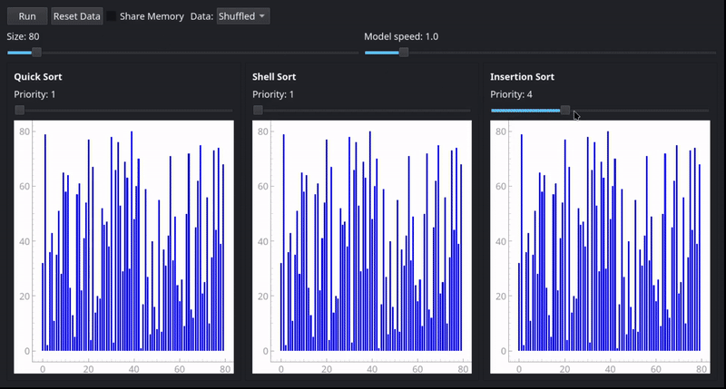

# Multi-threaded Sorting Visualizer

  

This project is a Python-based application designed to visualize the concurrent
execution of various sorting algorithms. It utilizes **PyQt5** and
**pyqtgraph** to provide a real-time graphical representation of how different
algorithms process data simultaneously.

---

## Key Features

*   **Algorithm Visualization:** Displays Quick Sort, Shell Sort, and Insertion
Sort side-by-side for comparative analysis.
*   **Thread Scheduling:** Utilizes a custom scheduler to manage background
threads. Execution speed is controlled by a priority system, allowing specific
algorithms to be allocated more "CPU time" dynamically during runtime.
*   **Shared Memory Simulation:** Includes a feature to point multiple
algorithms at the same data array. This demonstrates the effects of race
conditions and data corruption when synchronization is not enforced on shared
resources.
*   **Dynamic Parameters:** Supports real-time adjustments to the data set size
and global simulation speed through the user interface.
